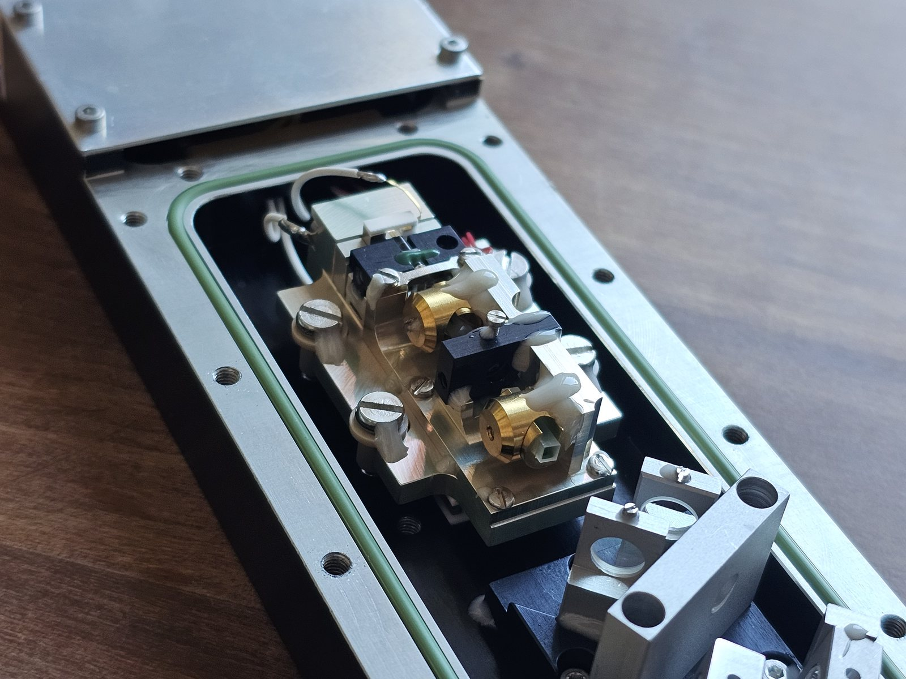
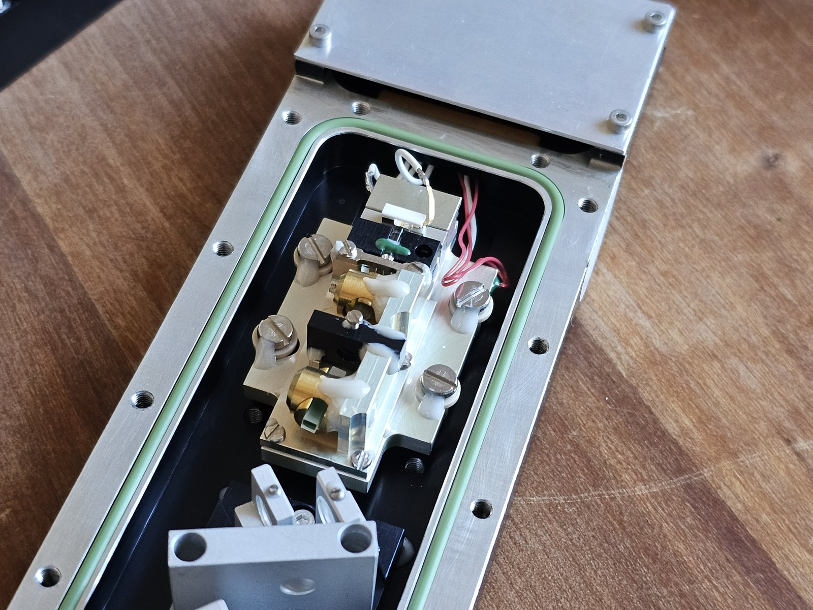
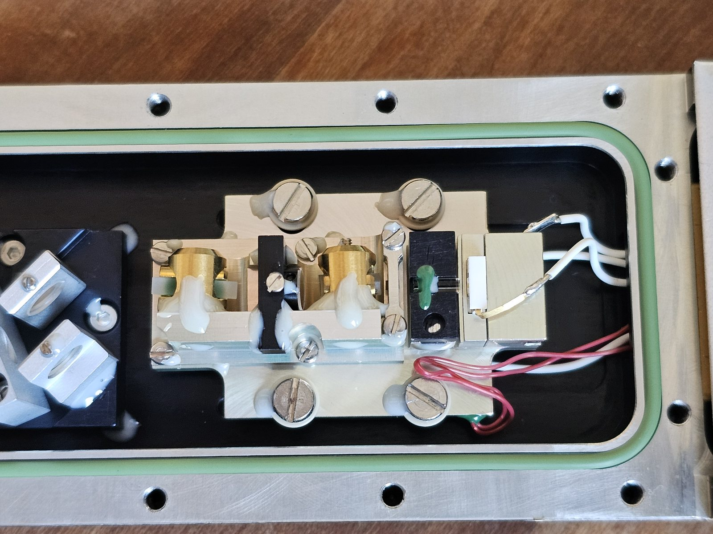
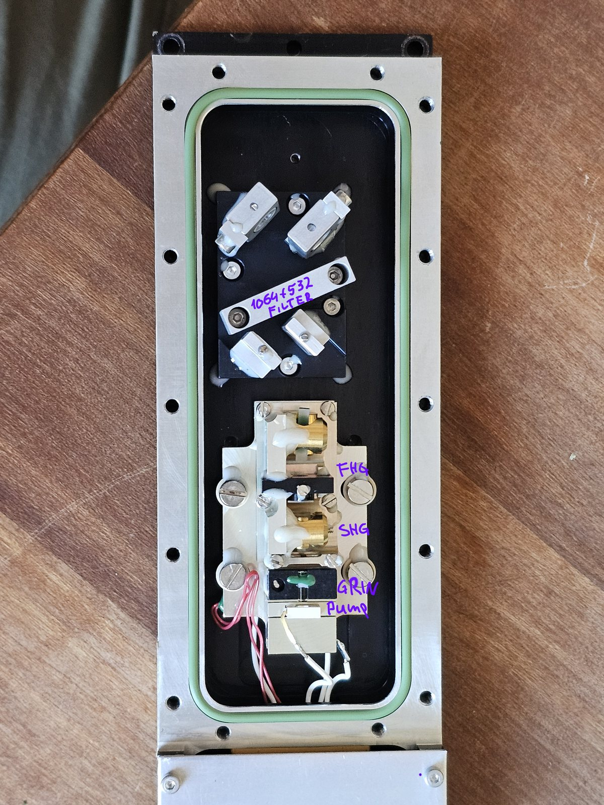
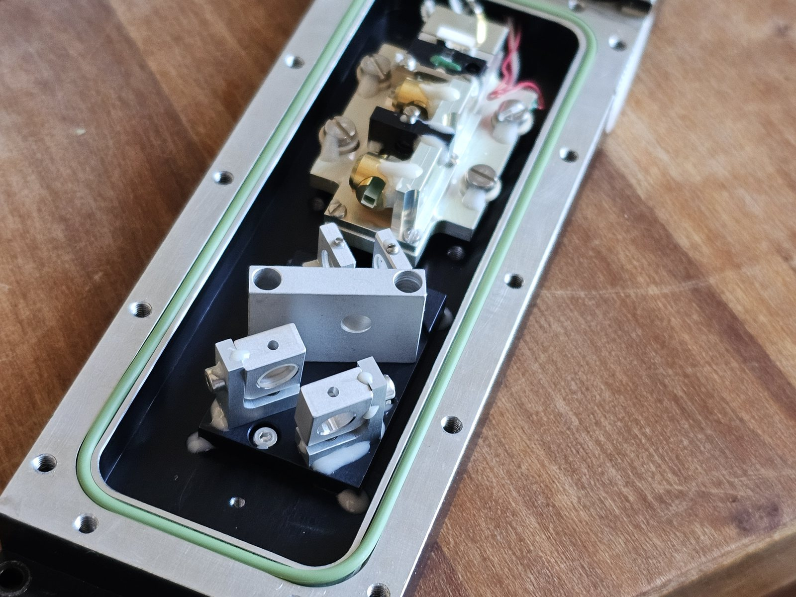
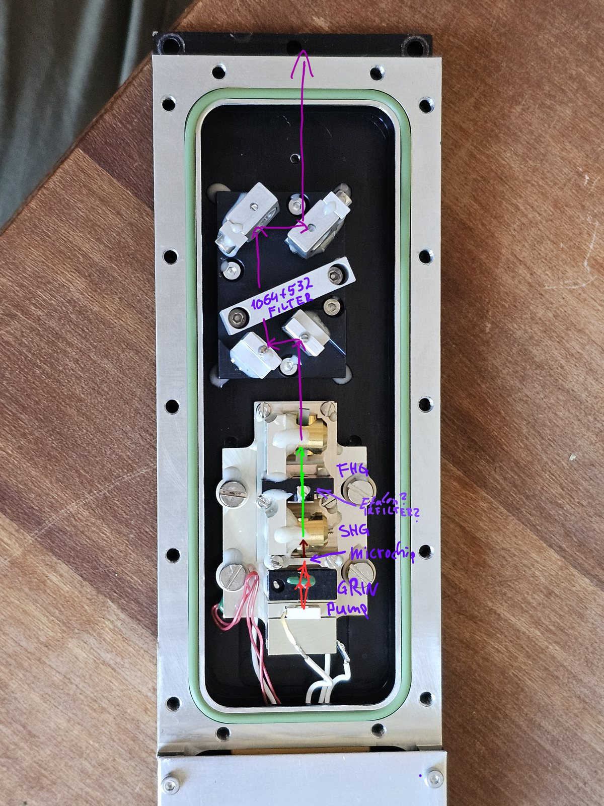

A teardown of a TEEM Photonics 266 nm microchip laser: a compact, passively Q-switched, deep-UV source producing sub-nanosecond pulses. The interesting part is how something this small forms a clean, single-transverse-mode beam.

<figure>

<figcaption>FIG. 01 — General view.</figcaption>
</figure>

## The microchip

This is a passively Q-switched (saturable-absorber) microchip laser. The heart of it is a chip only about 1 mm³, roughly 1 mm on each edge: a highly-doped Nd:YVO₄ gain crystal bonded to a Cr⁴⁺:YAG saturable absorber, which acts as the passive Q-switch. That combination produces about 500 ps pulses at the 1064 nm fundamental.

<figure>

<figcaption>FIG. 04 — The laser block.</figcaption>
</figure>

What makes it work is the cavity. Other than the crystal faces it is a plane-parallel (flat-flat) Fabry-Pérot resonator, which on paper is unstable. A stable TEM₀₀ mode forms anyway, purely from the thermal lens in the pumped crystal together with the strong GRIN-focused pump: together they provide the guiding that stabilizes the fundamental transverse mode. No curved mirror required.

<figure>

<figcaption>FIG. 05 — Pump block (top-down).</figcaption>
</figure>

## From 1064 nm to the deep UV

The 1064 nm fundamental is frequency-converted in two stages: second-harmonic generation to 532 nm, then fourth-harmonic generation (SHG of the 532 nm) to 266 nm. A set of harmonic separators then reflects only the 266 nm, dumping the residual 1064 and 532.

<figure>

<figcaption>FIG. 02 — Rough component divisions: pump diode, GRIN focusing lens, SHG and 4th-harmonic stages, and the harmonic separators (reflect 266 nm only).</figcaption>
</figure>

<figure>

<figcaption>FIG. 03 — Harmonic-separator assembly (front).</figcaption>
</figure>

<figure>

<figcaption>FIG. 06 — Annotated beam path, with the microchip, etalon, and conversion stages marked.</figcaption>
</figure>

<table class="spec-table">
  <tr><td>Output</td><td>266 nm (4th harmonic of 1064 nm)</td></tr>
  <tr><td>Gain / Q-switch</td><td>Highly-doped Nd:YVO₄ bonded to Cr⁴⁺:YAG (passive, saturable-absorber)</td></tr>
  <tr><td>Pulse width</td><td>~500 ps</td></tr>
  <tr><td>Microchip size</td><td>~1 mm³ (≈1 mm per edge)</td></tr>
  <tr><td>Cavity</td><td>Plane-parallel Fabry–Pérot; TEM₀₀ stabilized by pump thermal lens + GRIN focus</td></tr>
  <tr><td>Conversion</td><td>1064 → 532 (SHG) → 266 nm (4HG); separators reflect 266 nm only</td></tr>
</table>
