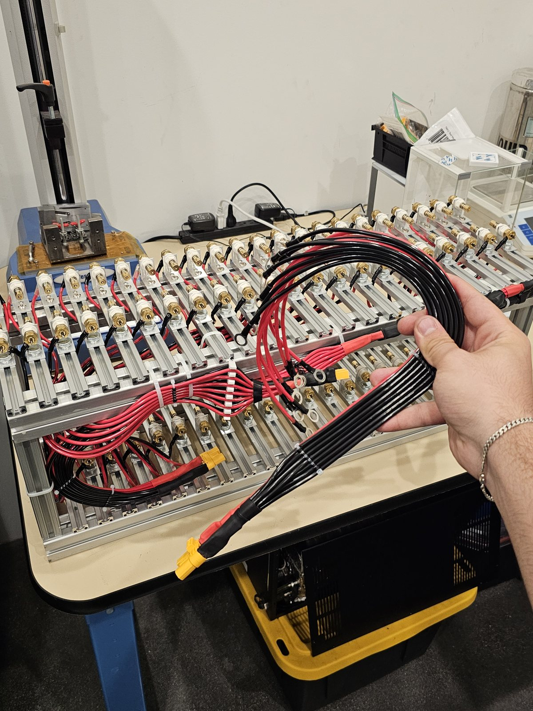
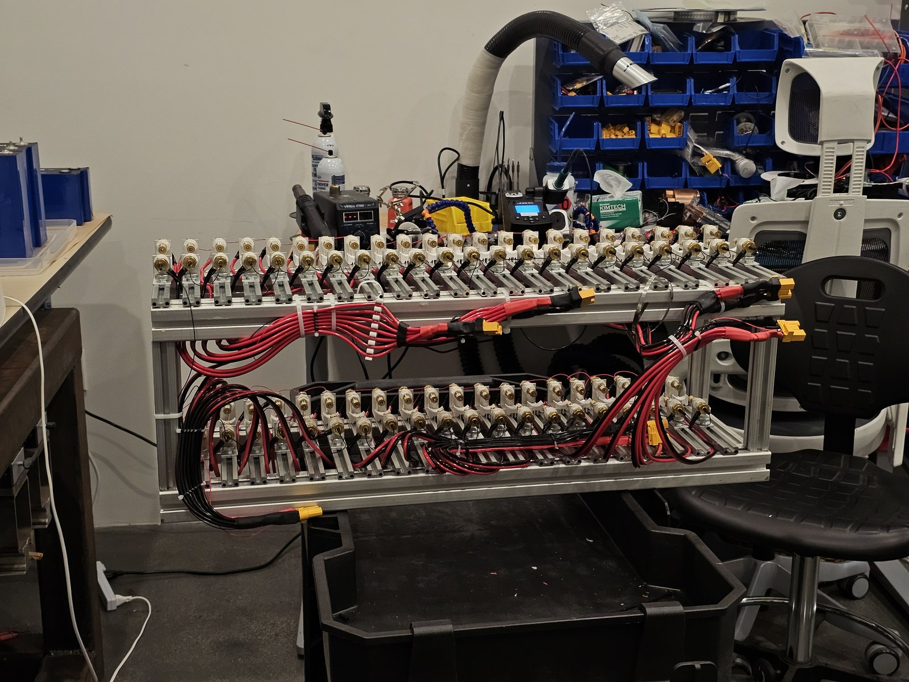
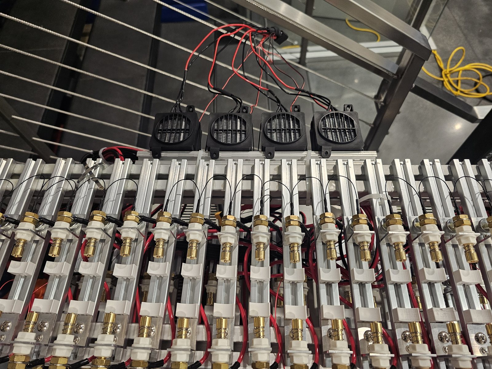
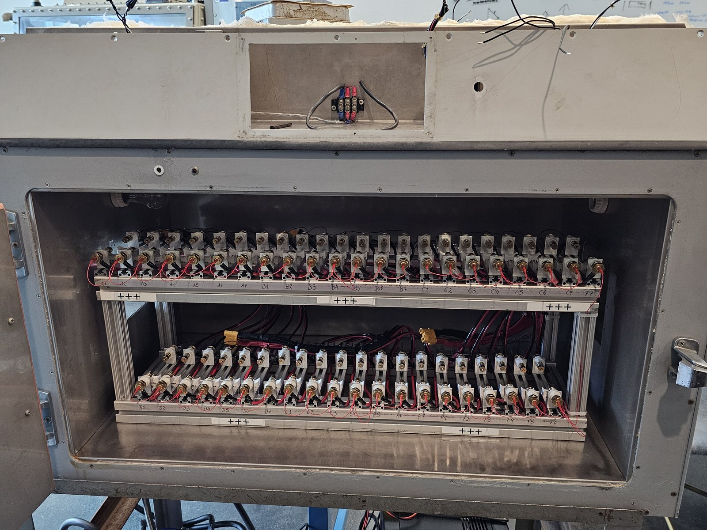
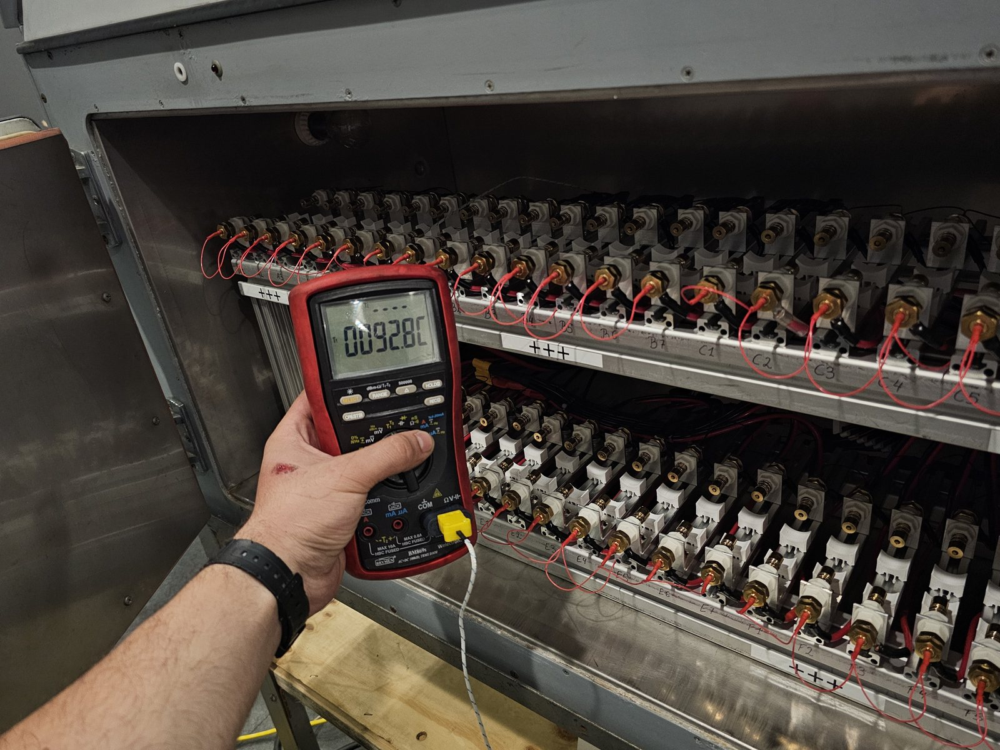
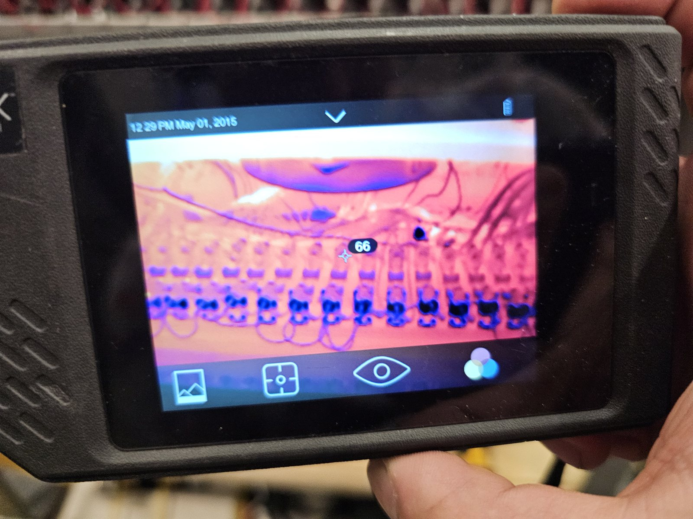
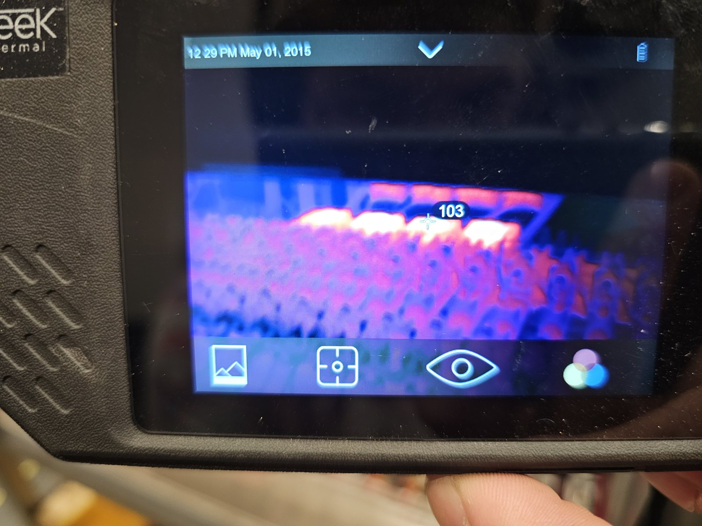
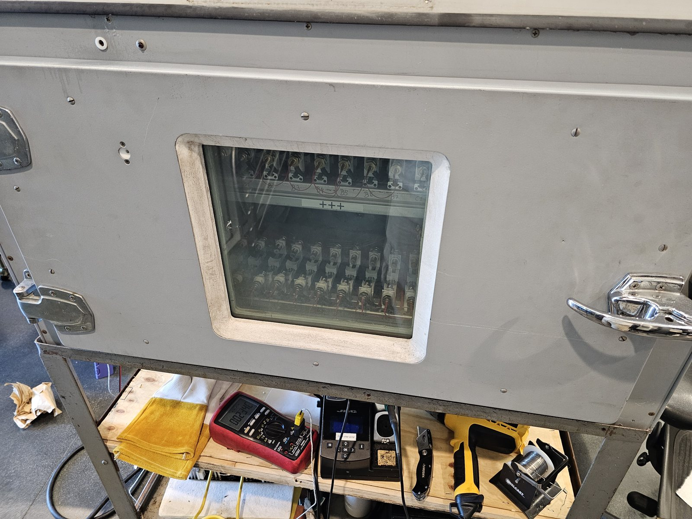
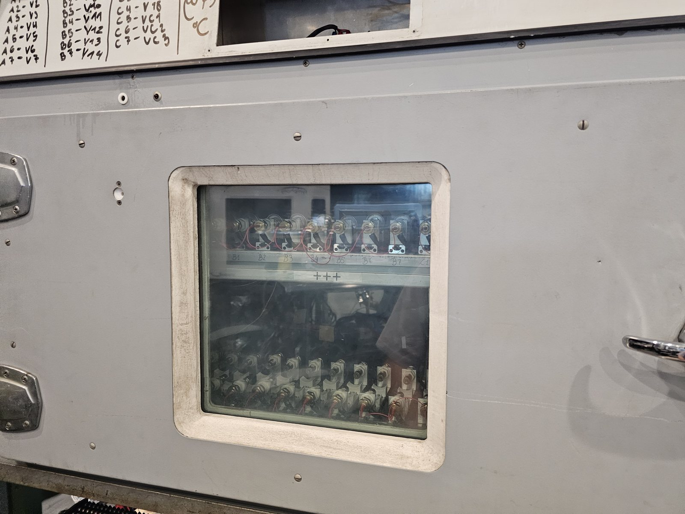
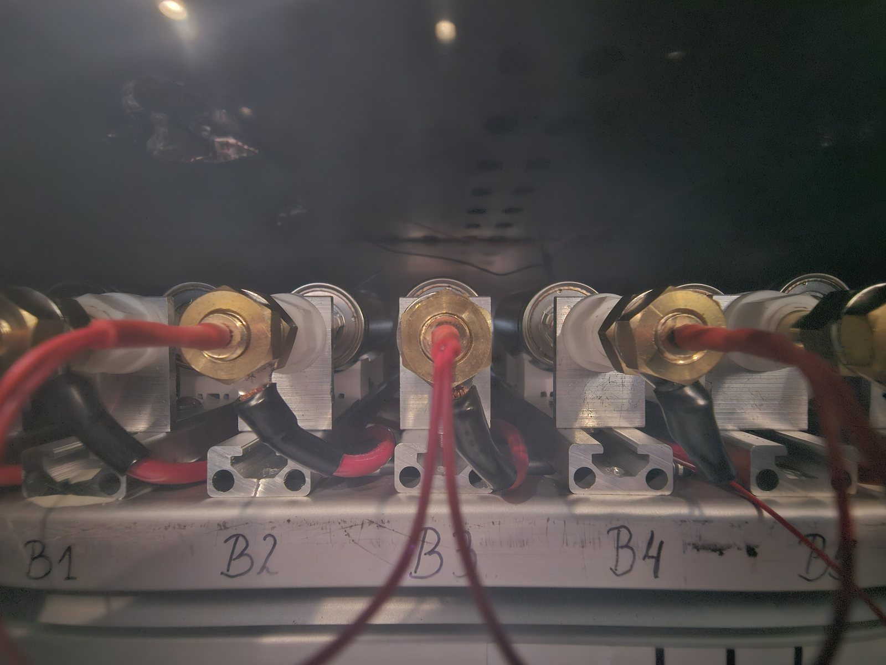

An automated test setup for cycling battery strings inside a thermally-controlled, insulated chamber — built to study cell performance across temperature under realistic, hard duty cycles.

The cell-holder structure carries **6 strings of 7 cells in parallel** (42 holders), each holder fitted with high-current, spring-loaded **Kelvin (4-wire) pin contacts** so the current and voltage-sense paths stay separate — voltage is measured at the cell, not across the harness. Every holder is individually sensed.

<figure>

<figcaption>FIG. 01 — Cell-holder array during harnessing.</figcaption>
</figure>

<figure>

<figcaption>FIG. 02 — Six strings × seven parallel cells, individually sensed.</figcaption>
</figure>

The power harnesses are built as **length- and resistance-matched pairs**, so charge and voltage distribute evenly across the parallel cells even during very hard cycles. Power distribution runs through **Amass XT120** connectors.

<figure>

<figcaption>FIG. 03 — Harness wiring; heater-blowers visible at the rear.</figcaption>
</figure>

The whole assembly sits inside a thermally insulated chamber before being connected out to the external cyclers.

<figure>

<figcaption>FIG. 04 — Assembly in the insulated chamber, prior to final connection.</figcaption>
</figure>

Heating is handled by the internal heater-blowers. An empty test run confirmed the chamber's heating capability, reaching **92.8 °C**:

<figure>

<figcaption>FIG. 05 — Empty-chamber heating test, 92.8 °C at the cell holders.</figcaption>
</figure>

Internal temperatures are cross-checked with a thermal camera:

<figure>

<figcaption>FIG. 06 — Thermal-camera readout of the chamber interior.</figcaption>
</figure>

<figure>

<figcaption>FIG. 07 — Interior temperature distribution.</figcaption>
</figure>

<table class="spec-table">
  <tr><td>Topology</td><td>6 strings × 7 parallel cells (42 holders)</td></tr>
  <tr><td>Contacts</td><td>High-current spring-loaded Kelvin (4-wire) pins</td></tr>
  <tr><td>Sensing</td><td>Per-cell-holder voltage; thermal-camera cross-check</td></tr>
  <tr><td>Harnessing</td><td>Length- &amp; resistance-matched pairs for balanced distribution</td></tr>
  <tr><td>Power connector</td><td>Amass XT120</td></tr>
  <tr><td>Thermal</td><td>Insulated chamber, internal heater-blowers (verified to 92.8 °C)</td></tr>
</table>

In use, with cells loaded and the chamber closed:

<figure>

<figcaption>FIG. 08 — Chamber closed and running under load.</figcaption>
</figure>

<figure>

<figcaption>FIG. 09 — Loaded cell-holder array.</figcaption>
</figure>

<figure>

<figcaption>FIG. 10 — Cycling under controlled temperature.</figcaption>
</figure>
