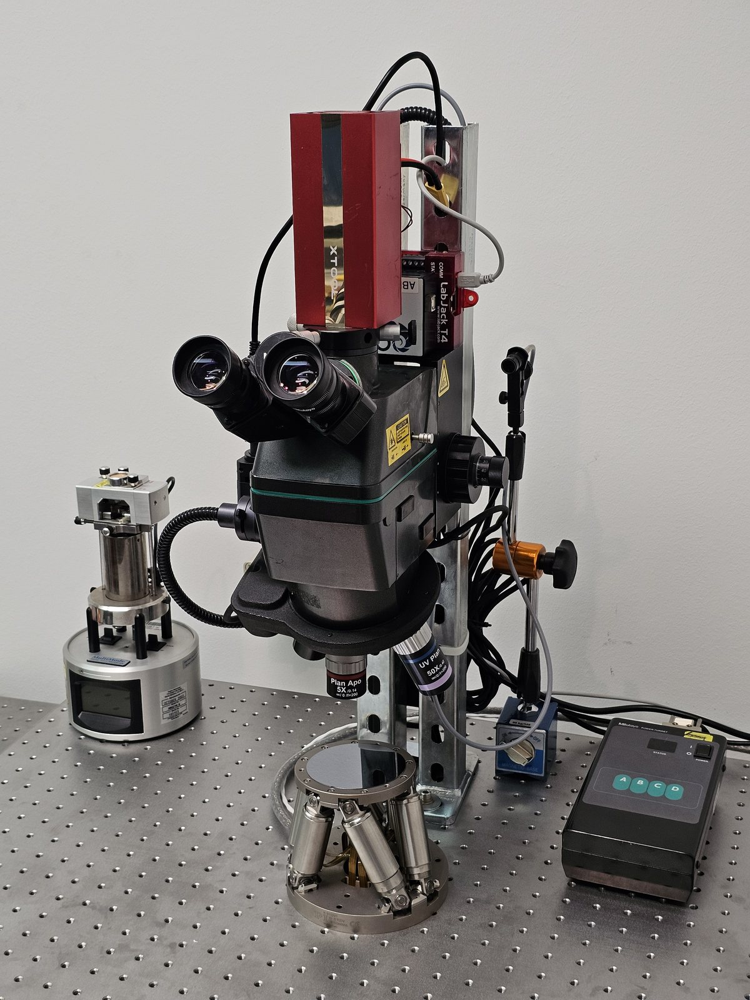
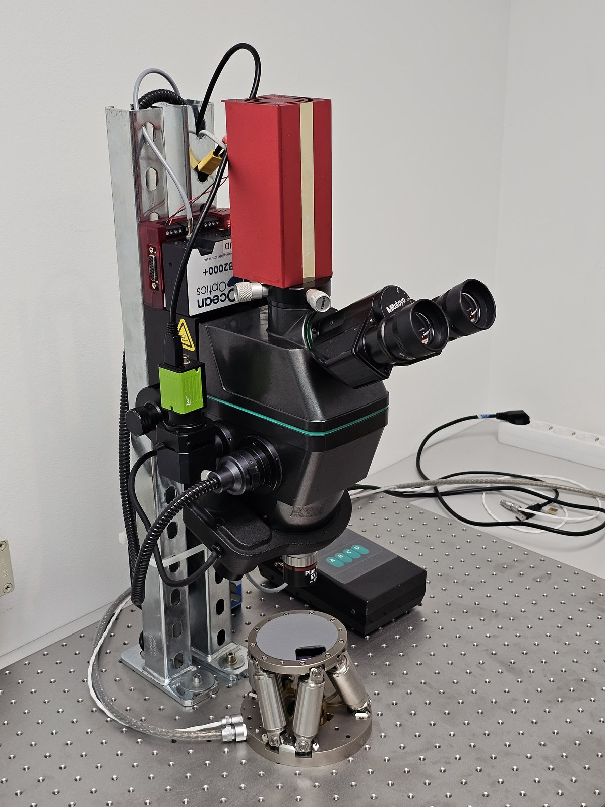
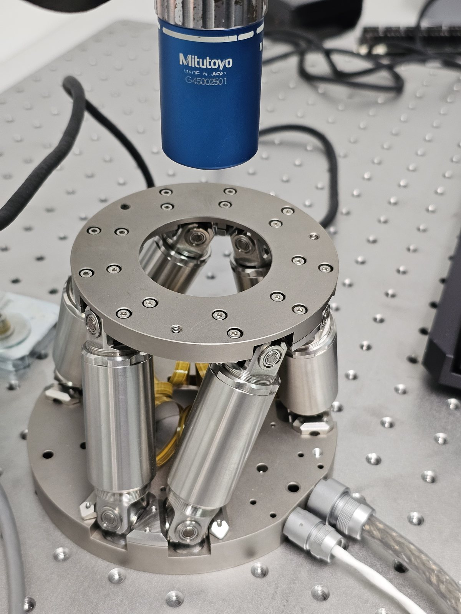
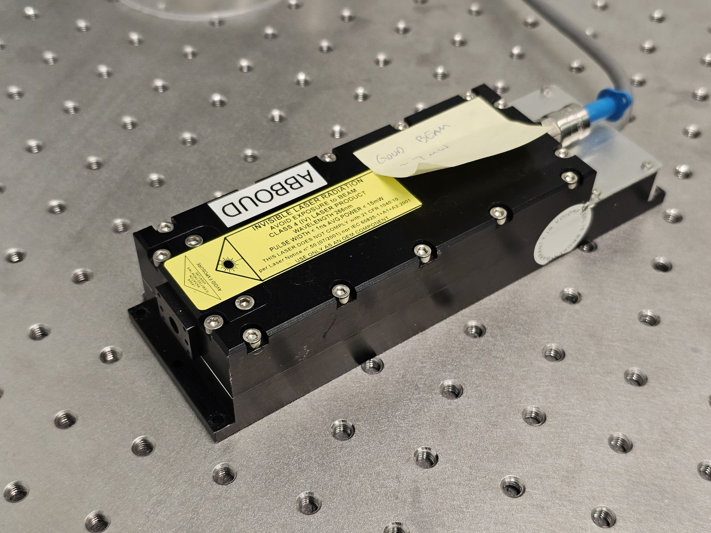

This microscope consists of a Mitutoyo FS70L4 as its core, shown here from both sides:

<figure>

<figcaption>FIG. 01 — FS70L4 core, right side.</figcaption>
</figure>

<figure>

<figcaption>FIG. 02 — FS70L4 core, left side.</figcaption>
</figure>

It uses a Physik Instrumente six-axis closed-loop piezo hexapod for high-precision sample manipulation, kindly provided by Prof. Dr. Georg Sommerer at the Berliner Hochschule für Technik ([laserscience.berlin](https://laserscience.berlin)).

<figure>

<figcaption>FIG. 03 — PI six-axis closed-loop piezo hexapod.</figcaption>
</figure>

It is currently equipped with a passively Q-switched 1064 nm DPSS laser, or an optional TEEM Photonics 266 nm sub-nanosecond-pulsewidth deep-UV laser for the most delicate work (teardown documentation coming soon).

<figure>

<figcaption>FIG. 04 — TEEM Photonics 266 nm head, &lt;1 ns pulses.</figcaption>
</figure>

<table class="spec-table">
  <tr><td>Core</td><td>Mitutoyo FS70L4</td></tr>
  <tr><td>Stage</td><td>PI six-axis closed-loop piezo hexapod</td></tr>
  <tr><td>Sources</td><td>1064 nm DPSS (pQS) · 266 nm TEEM Photonics, &lt;1 ns</td></tr>
  <tr><td>Spectrometer</td><td>Ocean Optics USB2000+ UV-NIR (LIBS / Raman)</td></tr>
  <tr><td>Illumination</td><td>TILL Photonics Polychrome IV tunable Xe short-arc source</td></tr>
  <tr><td>Control</td><td>LabJack T4</td></tr>
</table>

Additional components include an Ocean Optics USB2000+ UV-NIR spectrometer for LIBS and Raman analysis, a TILL Photonics Polychrome IV tunable-wavelength short-arc xenon light source, and a LabJack T4 for general control. It is also capable of conducting infrared in-situ microscopy — IRIS for short. See Bunnie Huang's work for more about that :-)
