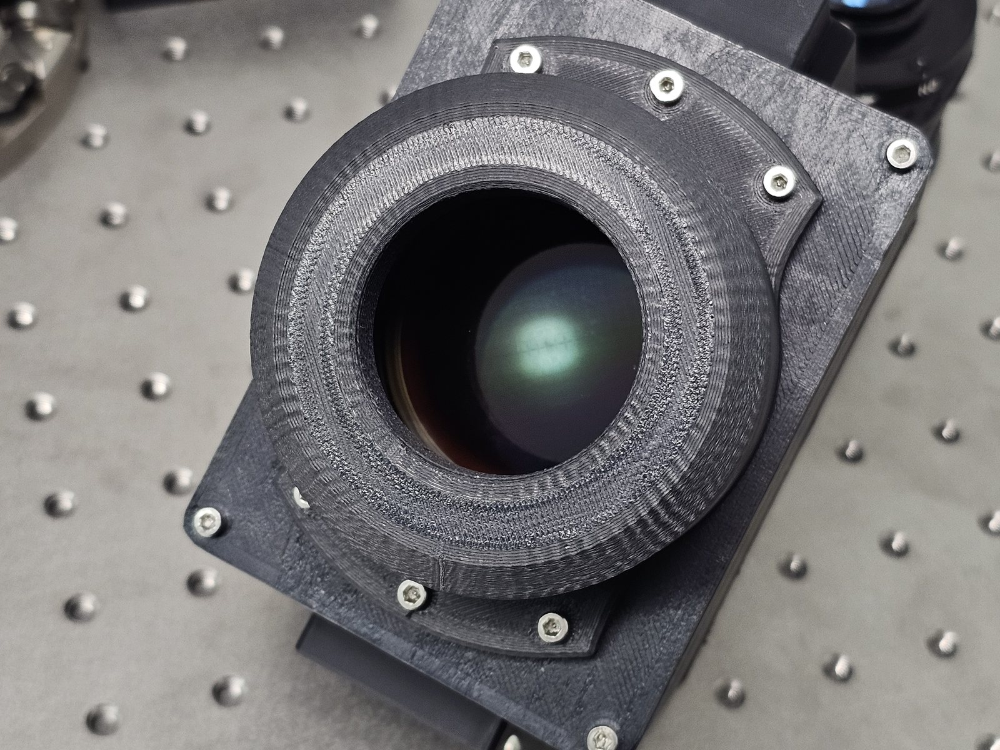
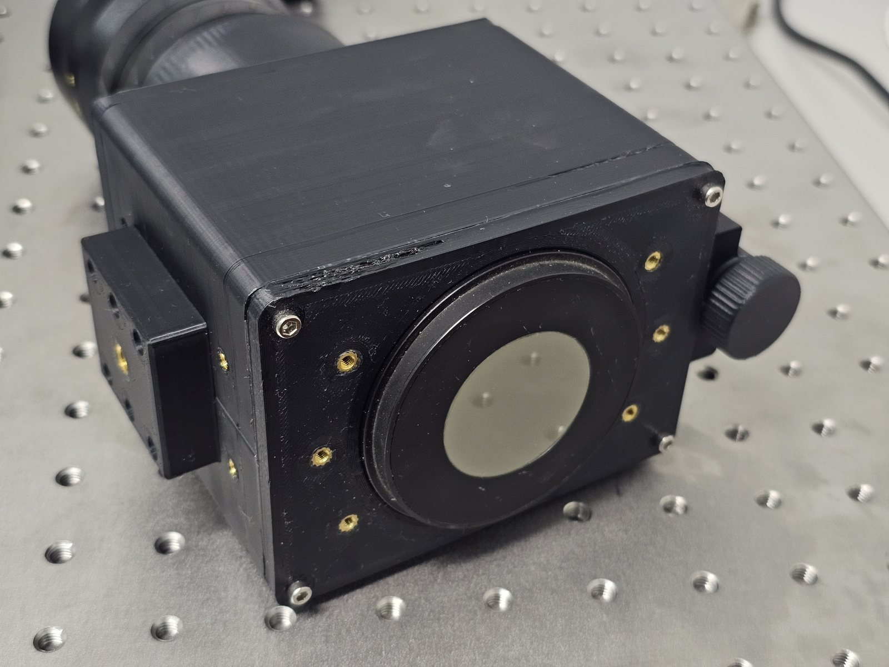
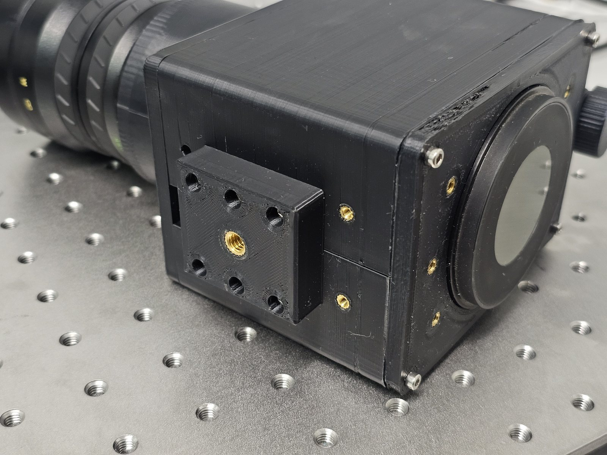
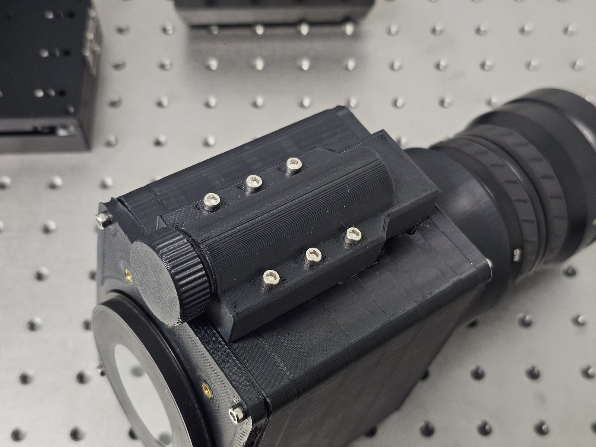

The Mullard / Philips XX1332 is a pretty gigantic Gen 2+ image intensifier tube. It has a 50 mm diameter fiber-optic-plate-bonded photocathode input and a 40 mm diameter fiber-optic-plate-bonded phosphor output screen, which makes it much larger than most tubes. This project builds it into a usable night-vision device.

<figure>

<figcaption>FIG. 01 — The 50 mm fiber-optic-plate-bonded photocathode.</figcaption>
</figure>

<figure>

<figcaption>FIG. 02 — The 40 mm phosphor output screen.</figcaption>
</figure>

I threw the housing together in Fusion since I needed something quick to test some things out. It is modular, so it takes different objectives on the input and different accessories on the output. There is a 1/4″ thread on the bottom for any standard mount, and a battery compartment that you twist to turn on.

<figure>

<figcaption>FIG. 03 — 1/4″ mounting thread on the base.</figcaption>
</figure>

<figure>

<figcaption>FIG. 04 — Battery compartment; twist to activate.</figcaption>
</figure>

Here it is running, in the 3D-printed housing with a 100 mm f/1.5 M42 objective:

<figure class="embed-wide">

<iframe src="https://www.youtube-nocookie.com/embed/udXu2fQ2_FI" title="Mullard XX1332 giant Gen 2 night-vision device in a 3D-printed housing" allow="encrypted-media; picture-in-picture; web-share" referrerpolicy="strict-origin-when-cross-origin" allowfullscreen loading="lazy"></iframe>

<figcaption>FIG. 05 — The device in its 3D-printed housing (video).</figcaption>
</figure>

<table class="spec-table">
  <tr><td>Tube</td><td>Mullard / Philips XX1332, Gen 2+ (large format)</td></tr>
  <tr><td>Photocathode input</td><td>50 mm diameter, fiber-optic-plate bonded</td></tr>
  <tr><td>Phosphor output</td><td>40 mm diameter, fiber-optic-plate bonded</td></tr>
  <tr><td>Housing</td><td>3D-printed (Fusion), modular, with swappable objectives &amp; output accessories</td></tr>
  <tr><td>Objective (shown)</td><td>100 mm f/1.5, M42 mount</td></tr>
  <tr><td>Mounting / power</td><td>1/4″ thread; battery compartment, twist-to-activate</td></tr>
</table>
